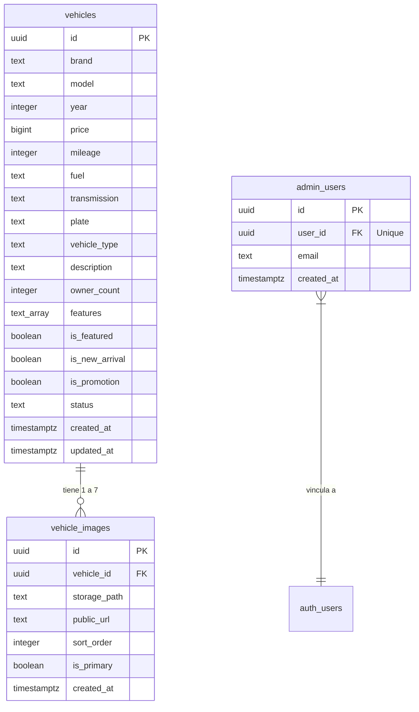

# Database Schema — TDI Motors

Este documento describe la estructura y diseño relacional de las tablas implementadas en Supabase (PostgreSQL) para la persistencia del catálogo de vehículos y administradores de TDI Motors.

---

## 🗺️ Diagrama de Relaciones

---

## 📊 Especificación de Tablas

### 1. Tabla: `vehicles`
Almacena la información técnica e identificadora de cada vehículo en venta.

| Columna | Tipo | Restricciones | Descripción |
|---------|------|---------------|-------------|
| `id` | `UUID` | `PRIMARY KEY`, default `gen_random_uuid()` | Identificador único del vehículo. |
| `brand` | `TEXT` | `NOT NULL` | Marca del vehículo (ej: MG, Kia). |
| `model` | `TEXT` | `NOT NULL` | Modelo del vehículo. |
| `year` | `INTEGER` | `NOT NULL`, `>= 1990` y `<= 2030` | Año de fabricación. |
| `price` | `BIGINT` | `NOT NULL`, `> 0` | Precio de venta en CLP. |
| `mileage` | `INTEGER` | `NOT NULL`, `>= 0` | Kilometraje actual en kilómetros. |
| `fuel` | `TEXT` | `NOT NULL`, default `Bencina` | Tipo de combustible. |
| `transmission` | `TEXT` | `NOT NULL`, default `Manual` | Tipo de transmisión. |
| `plate` | `TEXT` | `UNIQUE`, `NOT NULL` | Patente única chilena. |
| `vehicle_type` | `TEXT` | `NULL` | Tipo de carrocería del vehículo (SUV, Sedan, etc.). |
| `description` | `TEXT` | `NULL` | Detalle o descripción complementaria. |
| `owner_count` | `INTEGER` | Default `1` | Número de dueños anteriores. |
| `features` | `TEXT[]` | Default `'{}'` | Equipamientos en formato array. |
| `is_featured` | `BOOLEAN` | `NOT NULL`, default `FALSE` | Bandera para promocionar en el inicio. |
| `is_new_arrival` | `BOOLEAN` | `NOT NULL`, default `FALSE` | Bandera para la etiqueta "RECIÉN LLEGADO". |
| `is_promotion` | `BOOLEAN` | `NOT NULL`, default `FALSE` | Bandera para la etiqueta "OFERTA". |
| `status` | `TEXT` | `NOT NULL`, default `available` | Estado del vehículo (`draft`, `available`, `reserved`, `sold`, `archived`). |
| `created_at` | `TIMESTAMPTZ`| Default `NOW()` | Fecha de creación del registro. |
| `updated_at` | `TIMESTAMPTZ`| Default `NOW()` | Última actualización del registro. |

---

### 2. Tabla: `vehicle_images`
Almacena los enlaces a las imágenes almacenadas en el Storage.

| Columna | Tipo | Restricciones | Descripción |
|---------|------|---------------|-------------|
| `id` | `UUID` | `PRIMARY KEY`, default `gen_random_uuid()` | ID de la relación de la imagen. |
| `vehicle_id` | `UUID` | `REFERENCES vehicles(id) ON DELETE CASCADE` | Llave foránea del auto asociado. |
| `storage_path`| `TEXT` | `NOT NULL` | Ruta relativa dentro del bucket. |
| `public_url` | `TEXT` | `NOT NULL` | Enlace directo para cargar en navegadores. |
| `sort_order` | `INTEGER` | Default `0` | Orden de clasificación para visualización. |
| `is_primary` | `BOOLEAN` | Default `FALSE` | Si es la miniatura principal del catálogo. |
| `created_at` | `TIMESTAMPTZ`| Default `NOW()` | Fecha de registro de la imagen. |

---

### 3. Tabla: `admin_users`
Contiene a los usuarios de Supabase Auth aprobados como administradores.

| Columna | Tipo | Restricciones | Descripción |
|---------|------|---------------|-------------|
| `id` | `UUID` | `PRIMARY KEY`, default `gen_random_uuid()` | ID del registro. |
| `user_id` | `UUID` | `UNIQUE REFERENCES auth.users(id)` | UUID del usuario registrado en Auth. |
| `email` | `TEXT` | `UNIQUE` | Email del administrador para control visual. |
| `created_at` | `TIMESTAMPTZ`| Default `NOW()` | Fecha de asignación de privilegios. |

---

## ⚡ Índices de Rendimiento
Para acelerar las búsquedas sobre miles de visitas, se han configurado índices B-Tree específicos en PostgreSQL:
* `idx_vehicles_status`: Acelera la exclusión de vehículos vendidos en el catálogo público.
* `idx_vehicles_brand`: Optimiza la velocidad de filtrado por marca.
* `idx_vehicles_created`: Acelera el ordenamiento cronológico inverso de las novedades del catálogo.
* `idx_vehicle_images_sort`: Acelera los joins de imágenes optimizando la carga según el `sort_order`.

---

## ⚙️ Triggers y Funciones
* **`vehicles_updated_at`**: Modifica la columna `updated_at` cada vez que se actualiza cualquier campo del vehículo.
* **`enforce_max_images`**: Arroja un error e impide la inserción si el vehículo ya tiene 7 imágenes asociadas.
* **`single_primary_image`**: Si una imagen es marcada como `is_primary = TRUE`, el trigger actualiza todas las demás imágenes del mismo vehículo a `is_primary = FALSE`.
* **`get_vehicle_by_slug_suffix(suffix)`**: Función RPC que permite buscar un vehículo usando un sufijo de texto (los primeros 8 caracteres de su ID UUID), facilitando el soporte de URLs públicas amigables.
